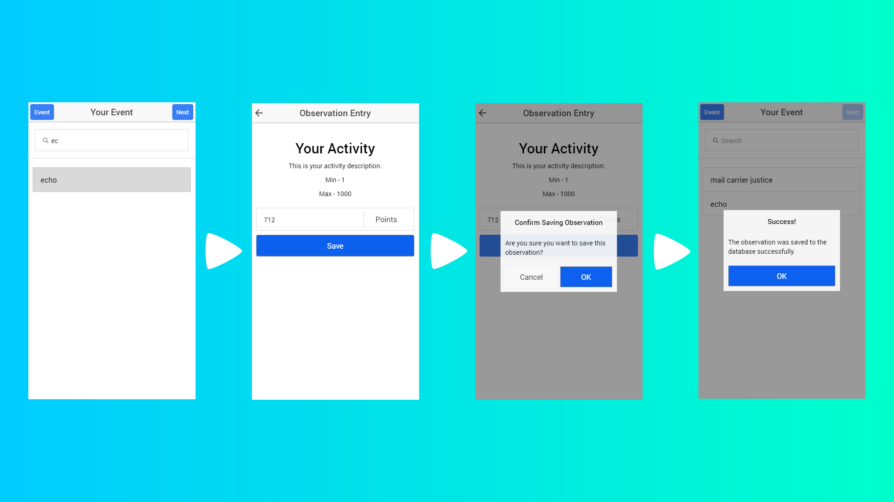

# ObserverApp

Welcome to the ObserverApp repository. This app is used to record how well participants did when doing the activities in the event that they are taking part in. The event and its activities were created using the **[Event Creator App][1]** and the participants were registered to the event using the **[Registrar App][2]**. The 'observers' of the activities at the event are the ones who use this app to submit the scores of each participant to the database. The 'observers' in this scenario are members of the team that is running the event, who are stationed at every different activity, waiting for participants who are participating in the event to do the activity and then record how well they did using the app. The different features of the app are explained below.

## List Of Participants

The list of participants/subjects (members of the public who are attending the event), is the first screen that is shown to the observer. It consists of a search box to search through the list and a list of nicknames corresponding to each participant. The screen also will show two buttons on either side of the title which are explained in the following sections.

## Adding An Observation To The Database

The observer is presented with a list of participants when the open the app (assuming that the app has been properly set up for the event that is running). The observer adds a record of how well the participant did by selecting him/her from the list of participants. The observer can search through the list to find the participant quickly and then select them by tapping the participants nickname. This enables the blue 'Next' button in the top right of the screen which, when pressed takes the user to the screen where they can enter the score that the participant achieved. The 'Observation Entry' screen will display the name of the activity that has been selected for this observer (typically the activity they are in charge of running). The observer will also see the description of the activity, the minimum and maximum values for this activity and an input box and submit button to type in the participants score and submit it.

## Changing Event And Activity

The method to changing the event and the activity is the same as it is in the **[Registrar App][3]**, with minor differences. The difference is that you must choose both an event and one of the activities for that event to be saved to the device that the app is installed on. Another minor difference is that the button to start this process is on the top left and is no longer an icon like in the Registrar App.

## Pull To Refresh

There is a pull to refresh feature implemented to make it easier to update the list of participants, as during the event more participants might be getting registered. The pull to refresh only works when the user is on the screen with the list of participants.

[1]: https://github.com/RatchetC/EventCreatorApp
[2]: https://github.com/RatchetC/RegistrarApp
[3]: https://github.com/RatchetC/RegistrarApp#changing-the-event